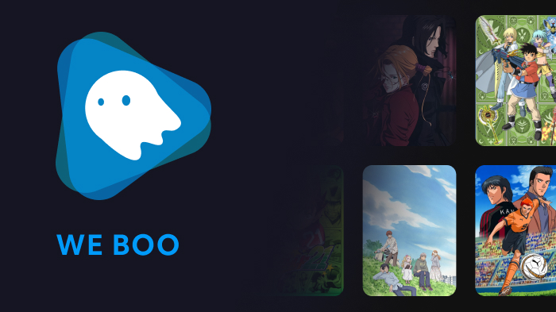
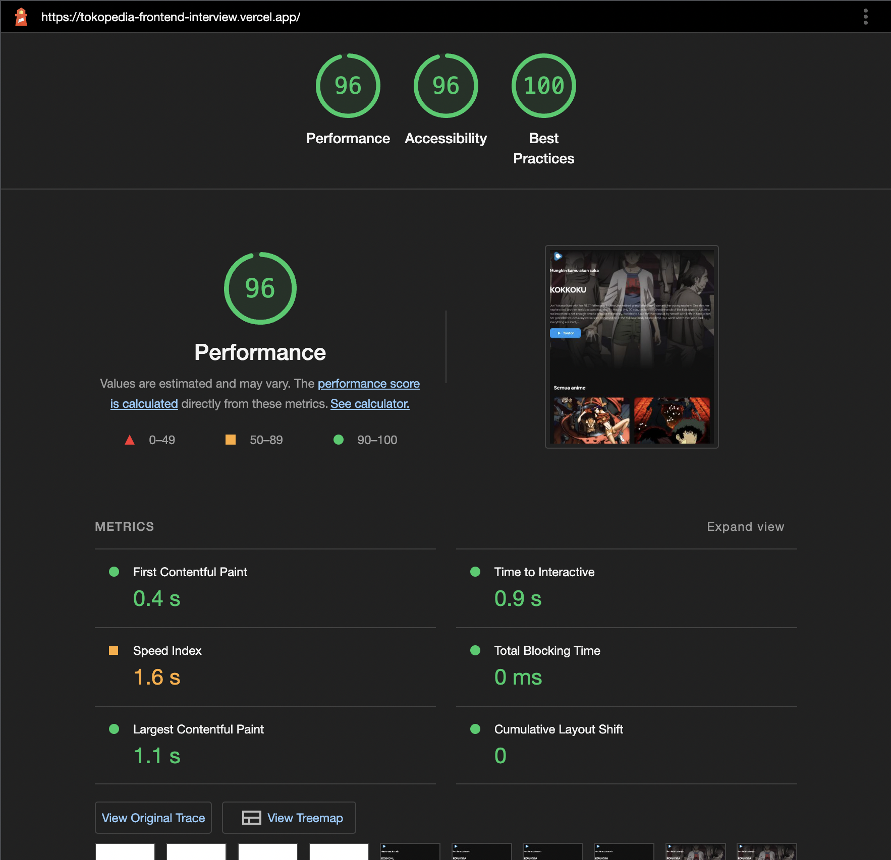
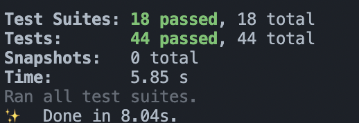

# Tokopedia Interview Test : We Boo
<div align="left">
  <p>
  This is, Tokopedia Interview test for role (Senior Web Engineer) - By Nando
  </p>
  <p>
  See hosted project : <a href="https://tokopedia-frontend-interview.vercel.app">https://tokopedia-frontend-interview.vercel.app</a>
  </p>
  <p>
  Activated the AMP in project just add ?amp=1 : <a href="https://tokopedia-frontend-interview.vercel.app/?amp=1">https://tokopedia-frontend-interview.vercel.app/?amp=1</a>
  </p>
</div>


## Project Purpose

This is a project example of an anime website that from [API](https://anilist.gitbook.io) store with state management, and meet all the functionality requirements.
## Goals

- [X] Home Page
- [ ] Pagination
- [ ] User Collection
- [ ] Detail Page

# Design

this web app UI design can be found in this [Figma](https://www.figma.com/file/i3E4rIDPw8ftkmLhOsFoHp/WeBoo-App?node-id=3%3A181) project

the UI not quite a good, it takes me 5 day for only thinking about the ui,
btw all the UI is create by myself [@xxidbr9](https://github.com/xxidbr9)


## Tools

- React v18
- Typescript
- Emotion (For styling)
- Turbo repo (Monorepo architecture)
- Babel
- Redux
  - Redux saga
  - Redux Toolkit
- Husky
- Eslint
- Jest
- Commitlint
- React Testing Library
- Apollo Graphql
- PWA
- More, open the project using `.` run in vscode web

## HOW TO RUN

#### Install all dependency
```bash
yarn
```
#### Run in Development mode (Nextjs Website)
```bash
cd apps/web-nextjs
yarn dev
```

#### Build all the Project
```bash
yarn build
```

## BONUS

- Github action for CICD [action file](./.github/workflows)
- Great Web performance (base on lighthouse)
  
- 100% Test Coverage (UI) Project
  

## TODO
- [ ] Test all file
- [ ] Installation Prompt show 
- [ ] SEO